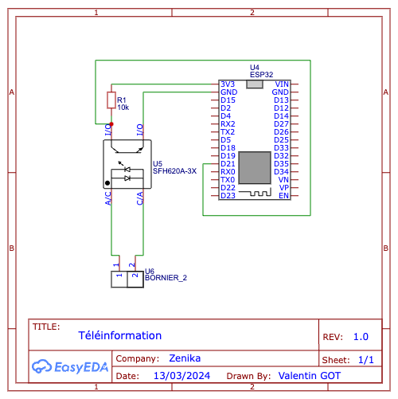
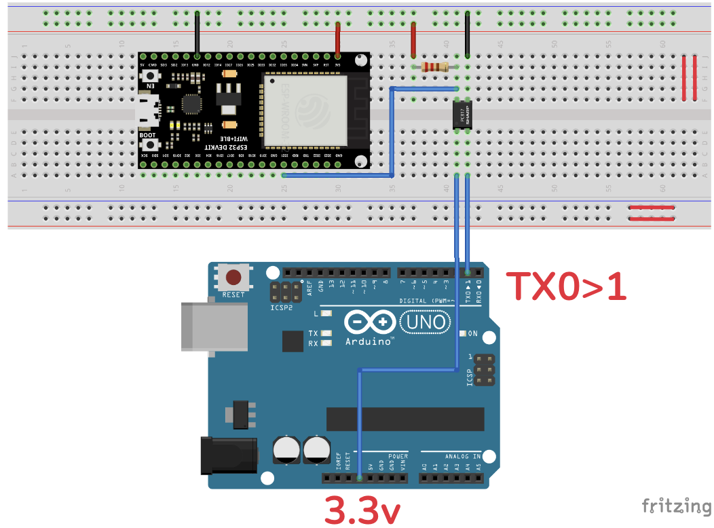

# Montage

## Télé-information

Le montage pour décoder les trames de télé-information est le suivant:

## Simulateur

- Compiler et uploader le simulateur sur une carte type Arduino
- Connecter le montage de télé-information au simulateur:

## Changer l'option tarifaire

Il est possible de changer l'option tarifaire sans avoir à recompiler le code.

Pour cela, il suffit de relier 2 pins de la carte arduino:

- PINs **5** & **6**: Option **BASE**
- PINs **7** & **6**: Option **HP / HC**
- PINs **8** & **9**: Option **EJP**
- PINs **10** & **9**: Option **BBRx (Tempo)**