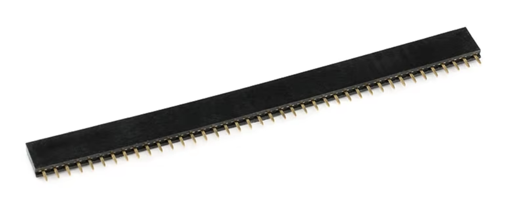

# Liste de courses montage télé-info

- [ ] ESP32 WROOM-32
- [ ] Optocoupleur SFH620A-3
- [ ] Résistance 10k Ohm

## Montage sur carte PCB + soudure

- [ ] Fils électrique à souder
- [ ] Carte PCB (mini 5x7cm)
- [ ] Connecteurs PCB femelle

- [ ] Borniers

## Montage sur breadboard sans soudure

- [ ] Câbles Dupont mâle <-> mâle
- [ ] Breadboard